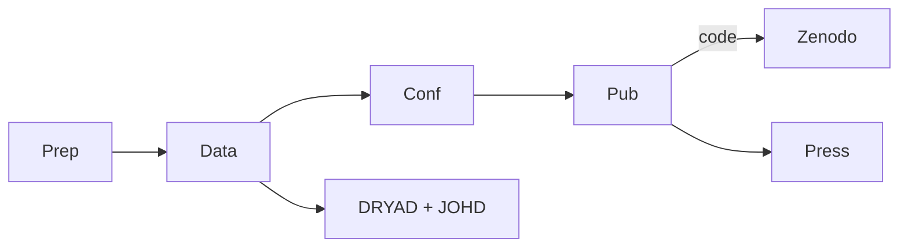

## Pipeline Flowchart

### Prep

- Manga Rock
- Co-author
- Pulp Fiction
- [Vsesvit](https://www.vsesvit-journal.com/about/)
- Vaccine
- Libgen

### Data

### Conference

### Publication

- Keyword Injection

### Press
