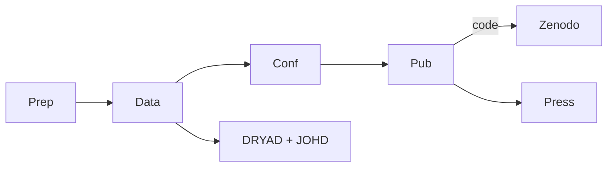

## Publication Pipeline Flowchart

```mermaid
flowchart LR
    prep["Prep"] --> data["Data"]
    data --> conf["Conf"]
    conf --> pub["Pub"]
    pub --> |code|code["Zenodo"]
    pub --> pop["Press"]
    data --> dryad["DRYAD + JOHD"]

```
